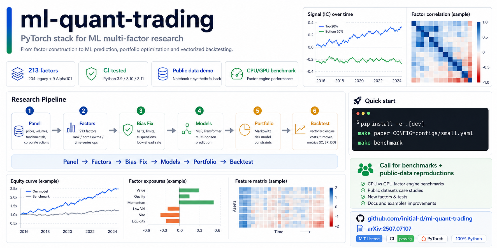

# ml-quant-trading

> **Machine Learning Enhanced Multi-Factor Quantitative Trading**
> — A Cross-Sectional Portfolio Optimization Approach with Bias Correction
>
> [arXiv:2507.07107](https://arxiv.org/abs/2507.07107) &nbsp;|&nbsp; Yimin Du, 2025

[](https://github.com/initial-d/ml-quant-trading/actions/workflows/ci.yml)
[](https://www.python.org/downloads/)
[](LICENSE)
[](https://docs.astral.sh/ruff/)



---

## What is this?

A **clean, fork-friendly, end-to-end** A-share quantitative trading system:

**In one clone, you get:** a tensor factor engine, 213 factor dimensions, bias correction,
ML baselines, Markowitz portfolio optimization, vectorized backtesting, synthetic/public-data
demos, CI, tests, and benchmark tooling.

| Module | What it does |
|--------|-------------|
| `features.tensor_factors` | GPU-vectorised masked primitives (`rank`, `corr`, `ewma`, `ts_*`) |
| `features.legacy_factors` | **204 hand-crafted alpha factors** ([handbook](docs/factor_handbook.md)) |
| `features.alpha101` | Alpha101-style formulaic factors |
| `features.neutralize` | Cross-sectional & industry neutralisation |
| `features.bias` | Limit-up / limit-down / halt bias correction |
| `training.augment` | GBM data augmentation |
| `models.nets` | MLP / Transformer |
| `models.losses` | AdjMSE, IC, RankIC losses |
| `portfolio.markowitz` | Cross-sectional Markowitz (shrunk cov, no-short) |
| `backtest.engine` | Vectorised backtest → Sharpe / IC / IR / DD |

---

## Why Star or Fork This Repository?

- You want a runnable reference implementation for ML-enhanced multi-factor research.
- You need a factor pipeline that handles masks, limit-up / limit-down events, halts, and cross-sectional operations.
- You want to reproduce or extend the accompanying paper without rebuilding data, factor, model, portfolio, and backtest modules from scratch.
- You are looking for a practical template for testing quantitative finance research code.

If you build on this work, please consider citing the paper and opening issues or pull requests for reproducibility notes, new examples, or benchmark results.

---

## Quick Start

```bash
git clone https://github.com/initial-d/ml-quant-trading.git
cd ml-quant-trading
pip install -e .[dev]        # add ,gpu for CUDA; add ,mosek for MOSEK solver

# 30-second smoke test (synthetic 200 stocks × 500 days)
make paper CONFIG=configs/small.yaml
```

### Google Colab Quick Start

You can run an end-to-end demo of this project instantly in Google Colab without installing anything locally:

[](https://colab.research.google.com/github/initial-d/ml-quant-trading/blob/main/demo_baostock.ipynb)

### Public-Data Factor IC Demo

For a lightweight public-data walkthrough, open [`notebooks/public_factor_ic.ipynb`](notebooks/public_factor_ic.ipynb). It downloads a small yfinance universe, computes a factor subset, and plots one-day forward rank IC. If public data download fails, the notebook falls back to the synthetic panel so the workflow remains runnable.

### Tensor Factor Benchmark

To benchmark core tensor primitives and a small factor subset on CPU/GPU, run:

```bash
make benchmark
```

See [`docs/benchmarking.md`](docs/benchmarking.md) for larger-panel commands and reporting guidance.
Benchmark reports from different machines are welcome through the
[`Benchmark result`](.github/ISSUE_TEMPLATE/benchmark_result.yml) issue template.

### Launch and Community Assets

- [`CHANGELOG.md`](CHANGELOG.md) summarizes the public baseline release.
- [`docs/launch_playbook.md`](docs/launch_playbook.md) contains the launch checklist,
  recommended repository topics, and social preview guidance.
- [`docs/start_here.md`](docs/start_here.md) gives new users a fast path through the project.
- [`docs/faq.md`](docs/faq.md) answers common setup, data, and reproducibility questions.
- [`docs/benchmark_board.md`](docs/benchmark_board.md) tracks community benchmark reports.
- [`docs/community.md`](docs/community.md) explains contribution lanes and maintainer response rules.
- [`docs/release_draft_v0.1.0.md`](docs/release_draft_v0.1.0.md) is a copy-ready first release draft.
- [`docs/promotion_kit.md`](docs/promotion_kit.md) contains copy-ready social and community posts.
- [`docs/community_outreach.md`](docs/community_outreach.md) lists target communities and copy-ready outreach posts.
- [`docs/content_calendar.md`](docs/content_calendar.md) turns real updates into a four-week launch rhythm.

---

## Factor Library (213 factors: 9 Alpha101 + 204 legacy)

The full feature set comprises **9 curated Alpha101 formulas** (`features.alpha101`) plus **204 hand-crafted legacy factors** (`features.legacy_factors`) for a total of **213 dimensions**. All factors are mask-aware PyTorch tensors with signature `Panel → (values[T,N], mask[T,N])`.

📖 **[完整因子手册 (Factor Handbook)](docs/factor_handbook.md)** — 每个因子一段话详解思想、动机和原理，方便按需选用。

| Family | Count | Description |
|--------|-------|-------------|
| `better_001` – `better_028` | 28 | VWAP deviation + volume-weighted momentum |
| `best_001` – `best_021` | 21 | Close-location momentum variants |
| `old_027` – `old_076` | 50 | Classic alpha signals (corr/rank composites) |
| `stock_001` – `stock_022` | 22 | Per-stock derived series (volume, range, price) |
| `extra_001` – `extra_014` | 14 | Turnover + amount features |
| `add_001` – `add_030` | 30 | Additional composite factors |
| `change_001` – `change_005` | 5 | Short-window change-of-velocity |
| `original_001` – `original_028` | 28 | Close/volume direct statistics |
| `cs_rank_*` | 6 | Market breadth (cross-sectional rank signals) |

<details>
<summary><b>Full factor list (click to expand)</b></summary>

```
add_001    add_002    add_003    add_004    add_005    add_006
add_007    add_008    add_009    add_010    add_011    add_012
add_013    add_014    add_015    add_016    add_017    add_018
add_019    add_020    add_021    add_022    add_023    add_024
add_025    add_026    add_027    add_028    add_029    add_030
best_001   best_002   best_003   best_004   best_005   best_006
best_007   best_008   best_009   best_010   best_011   best_012
best_013   best_014   best_015   best_016   best_017   best_018
best_019   best_020   best_021
change_001 change_002 change_003 change_004 change_005
extra_001  extra_002  extra_003  extra_004  extra_005  extra_006
extra_007  extra_008  extra_009  extra_010  extra_011  extra_012
extra_013  extra_014
old_027    old_028    old_029    old_030    old_031    old_032
old_033    old_034    old_035    old_036    old_037    old_038
old_039    old_040    old_041    old_042    old_043    old_044
old_045    old_046    old_047    old_048    old_049    old_050
old_051    old_052    old_053    old_054    old_055    old_056
old_057    old_058    old_059    old_060    old_061    old_062
old_063    old_064    old_065    old_066    old_067    old_068
old_069    old_070    old_071    old_072    old_073    old_074
old_075    old_076
original_001 original_002 original_003 original_004 original_005
original_006 original_007 original_008 original_009 original_010
original_011 original_012 original_013 original_014 original_015
original_016 original_017 original_018 original_019 original_020
original_021 original_022 original_023 original_024 original_025
original_026 original_027 original_028
stock_001  stock_002  stock_003  stock_004  stock_005  stock_006
stock_007  stock_008  stock_009  stock_010  stock_011  stock_012
stock_013  stock_014  stock_015  stock_016  stock_017  stock_018
stock_019  stock_020  stock_021  stock_022
```

</details>

### Data Sources

You can directly fetch stock data from Yahoo Finance or Baostock (for A-shares).

**yfinance:**
```python
from mlquant.data import make_panel

panel = make_panel(
    source="yfinance",
    tickers=["000001.SZ", "600000.SS"],
    start="2020-01-01",
    end="2023-12-31"
)
```

**baostock:**
```python
from mlquant.data import make_panel

panel = make_panel(
    source="baostock",
    tickers=["sh.600000", "sz.000001"],
    start="2020-01-01",
    end="2023-12-31"
)
```

### Usage

```python
from mlquant.features import compute_legacy_set, LEGACY_REGISTRY

# Compute all 204 factors
factors, mask, names = compute_legacy_set(panel)  # → [T, N, 204]

# Or a subset
factors, mask, names = compute_legacy_set(panel, names=("best_001", "add_015", "old_042"))
```

---

## Architecture

```
raw OCHLV → data.loaders / data.synthetic / data.yfinance_loader / data.baostock_loader (Panel with mask)
         → features.tensor_factors (GPU masked primitives)
         → features.legacy_factors (204 alphas)
         → training.augment + models.nets + models.losses
         → portfolio.markowitz (efficient frontier)
         → backtest.engine → Sharpe / IC / IR / DD / turnover
```

---

## Project Layout

```
ml-quant-trading/
├── src/mlquant/
│   ├── data/           # Panel dataclass, loaders, synthetic generator
│   ├── features/       # Factor engine + 204 legacy + Alpha101
│   ├── training/       # Dataset, augmentation, trainer
│   ├── models/         # MLP, Transformer, losses
│   ├── portfolio/      # Markowitz, frontier sweep
│   ├── backtest/       # Engine, metrics
│   └── cli/            # Command-line interface
├── configs/            # small.yaml (smoke) / paper.yaml (full)
├── tests/              # pytest suite
├── scripts/            # IC eval, frontier plot
├── legacy/             # Original research scripts (archival, unsupported)
└── docs/               # Architecture, factor docs, paper reproduction
```

---

## Reproducing the Paper

See [`docs/reproducing_paper.md`](docs/reproducing_paper.md) for table-by-table mapping.

| Paper section | Code module | Tests |
|---|---|---|
| §3.1 Tensor factor engine | `features.tensor_factors` | `test_tensor_factors` |
| §3.2 Alpha + microstructure factors | `features.alpha101`, `features.legacy_factors` | `test_alpha101` |
| §3.3 Neutralisation | `features.neutralize` | — |
| §3.4 Bias correction | `features.bias` | `test_bias` |
| §4.1 GBM augmentation | `training.augment` | `test_augment` |
| §4.2 ML models | `models.nets`, `models.losses` | `test_losses` |
| §5 Portfolio optimisation | `portfolio.markowitz` | `test_markowitz` |
| §6 Backtest | `backtest.engine`, `backtest.metrics` | `test_metrics` |

---

## Roadmap

See [`docs/roadmap.md`](docs/roadmap.md) for contributor-friendly tasks, research extensions,
engineering extensions, and community milestones.

For announcements, release posts, and benchmark calls, see the
[`Promotion Kit`](docs/promotion_kit.md). For the maintainer growth loop, see
[`docs/growth_plan.md`](docs/growth_plan.md).

## Contributing

Contributions are welcome, especially docs, reproducibility notes, tests, data adapters, and small examples. See [`CONTRIBUTING.md`](CONTRIBUTING.md) for setup and pull request guidance.

## Disclaimer

This repository is for research and engineering experimentation. It is not financial advice, investment advice, or a trading recommendation. Historical backtests and factor results do not guarantee future performance.

---

## Citation

```bibtex
@article{du2025mlquant,
  title  = {Machine Learning Enhanced Multi-Factor Quantitative Trading:
            A Cross-Sectional Portfolio Optimization Approach with Bias Correction},
  author = {Du, Yimin},
  journal= {arXiv preprint arXiv:2507.07107},
  year   = {2025},
  url    = {https://arxiv.org/abs/2507.07107}
}
```

## License

MIT — see [`LICENSE`](LICENSE).
