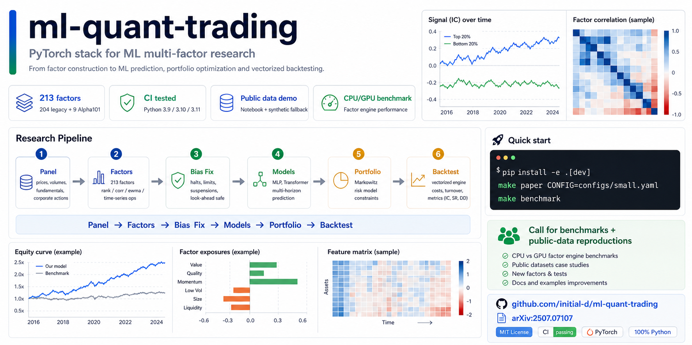

# ml-quant-trading

Languages: [English](README.md) | [简体中文](README.zh-CN.md) | [繁體中文](README.zh-TW.md)

> **机器学习增强的多因子量化交易**——采用偏差修正的横截面投资组合优化方法。
>
> [arXiv:2507.07107](https://arxiv.org/abs/2507.07107) &nbsp;|&nbsp;
> [Hugging Face Papers](https://huggingface.co/papers/2507.07107) &nbsp;|&nbsp; Yimin Du，2025

[](https://github.com/initial-d/ml-quant-trading/actions/workflows/ci.yml)
[](https://github.com/initial-d/ml-quant-trading/stargazers)
[](https://github.com/initial-d/ml-quant-trading/releases)
[](https://pypi.org/project/mlquantx/)
[](https://www.python.org/downloads/)
[](LICENSE)



[**Colab 在线运行**](https://colab.research.google.com/github/initial-d/ml-quant-trading/blob/main/notebooks/quickstart_colab.ipynb)
· [**查看公开验证结果**](docs/validation_dashboard.md)
· [**体验数据集与模型**](docs/huggingface_artifacts.md)
· [**阅读论文**](https://arxiv.org/abs/2507.07107)
· [**提交一次复现报告**](https://github.com/initial-d/ml-quant-trading/issues/new?template=reproduction_report.yml)

> **v0.2.6：打通 PyPI 到 GitHub 的参与路径。**发行包名为 `mlquantx`，
> Python 导入名和命令仍是 `mlquant`。Demo 成功后会直接给出源码、复现
> 报告表单和下一步贡献入口。

> **2026 年 8 月复现挑战：**打开零账号 Colab 跑一次，把自动生成的报告、
> 运行环境和 commit SHA 填入[结构化报告表单](https://github.com/initial-d/ml-quant-trading/issues/new?template=reproduction_report.yml)。
> 成功和失败结果都欢迎；符合要求的报告会署名加入社区验证区，并汇总到 [Discussion #43](https://github.com/initial-d/ml-quant-trading/discussions/43)。

## 项目概述

`ml-quant-trading` 是一个简洁、便于 fork 的端到端 A 股量化研究系统。仓库集成了张量因子引擎、213 维因子库、偏差修正、ML baseline、Markowitz 投资组合优化、向量化回测、synthetic 与公开数据演示，以及 CI、测试与 benchmark 工具，适合复现和扩展多因子量化研究。

## 快速入口

| 你的目标 | 从这里开始 | 能得到什么 |
|---|---|---|
| 先看项目能否跑通 | `mlquant demo` | 30–90 秒、无需行情数据的端到端冒烟测试 |
| 不安装直接体验 | [Google Colab](https://colab.research.google.com/github/initial-d/ml-quant-trading/blob/main/notebooks/quickstart_colab.ipynb) | 无需账号或行情 API 的浏览器内完整 Demo |
| 检查可下载产物 | [Hugging Face 数据集](https://huggingface.co/datasets/dddyym/ml-quant-trading-synthetic) · [MLP 模型](https://huggingface.co/dddyym/ml-quant-trading-synthetic-mlp) | 由确定性 Quick Start 导出的 10 万行 synthetic 数据和 213 输入模型；不含真实或专有行情 |
| 查看真实公开数据结果 | [CSI 300 验证看板](docs/validation_dashboard.md) | 成本敏感性、换手率、基线与复现命令 |
| 理解研究结论边界 | [Research Card](docs/research_card.md) | 适用范围、非目标、数据假设与已知限制 |
| 贡献一次运行结果 | [复现报告表单](https://github.com/initial-d/ml-quant-trading/issues/new?template=reproduction_report.yml) | 跑 Colab、结构化提交报告并获得 README 署名 |

## 当前公开验证

最新维护结果采用 AkShare 的当前沪深 300 公开数据，在日频 213 因子近似流程中显式计入换手和交易成本。缓冲因子组合在 7 bps 有效成本假设下得到 22.20% 年化收益、0.919 Sharpe；同区间等权基线为 17.75% 和 0.882。完整口径、成本敏感性图和复现命令见[验证看板](docs/validation_dashboard.md)。

这些结果是公开数据上的研究近似，不是论文的精确复现，不代表样本外收益，也不构成投资建议。

## 社区验证与贡献

| 外部贡献 | 内容 |
|---|---|
| [PR #18](https://github.com/initial-d/ml-quant-trading/pull/18) | ETF 跨资产公开数据复现 |
| [PR #34](https://github.com/initial-d/ml-quant-trading/pull/34) | Windows/Baostock 25 只 A 股验证 |
| [PR #35](https://github.com/initial-d/ml-quant-trading/pull/35) | 中性化与 Baostock 稳健性修复 |
| [PR #36](https://github.com/initial-d/ml-quant-trading/pull/36) | 全因子族英文手册 |
| [PR #42](https://github.com/initial-d/ml-quant-trading/pull/42) | 支撑 CSI 300 验证的零账号 AkShare 加载器 |
| [PR #47](https://github.com/initial-d/ml-quant-trading/pull/47) | 澄清累计交易成本的时间口径，并补充兼容层、测试和文档 |

这些结果链接到原始 PR，便于检查环境、命令、限制和评审过程。你也可以
[打开零账号 Colab，运行并提交生成的报告](https://colab.research.google.com/github/initial-d/ml-quant-trading/blob/main/notebooks/quickstart_colab.ipynb)。
本月结果请用[结构化复现报告表单](https://github.com/initial-d/ml-quant-trading/issues/new?template=reproduction_report.yml)提交，并汇总到 [2026 年 8 月复现挑战](https://github.com/initial-d/ml-quant-trading/discussions/43)。

## 研究与教学用途声明

> **仅用于研究和教学。** 本项目不构成金融或投资建议，也不是可直接用于实盘交易的生产系统。回测结果不代表真实交易表现，并会受到数据质量、交易成本、滑点及建模假设等因素影响。所有结果都应视为研究验证，而非已经证实的样本外收益或可部署 alpha。已知限制请参阅 [Reality Check](docs/reality_check.md)。

## 核心模块

| 模块 | 功能 |
|------|------|
| `features.tensor_factors` | 带 mask 的 GPU 向量化基础算子（`rank`、`corr`、`ewma`、`ts_*`） |
| `features.legacy_factors` | 204 个手工构建的 alpha 因子（参阅[因子手册](docs/factor_handbook.md)） |
| `features.alpha101` | Alpha101 风格的公式化因子 |
| `features.neutralize` | 横截面与行业中性化 |
| `features.bias` | 涨停、跌停与停牌偏差修正 |
| `training.augment` | GBM 数据增强 |
| `models.nets` | MLP / Transformer |
| `models.losses` | AdjMSE、IC、RankIC loss |
| `portfolio.markowitz` | 横截面 Markowitz 优化（收缩协方差、禁止卖空） |
| `backtest.engine` | 向量化回测，输出 Sharpe / IC / IR / DD 等指标 |

因子库共包含 **213 个因子**：9 个精选 Alpha101 公式和 204 个手工构建的 legacy 因子。完整说明请参阅[因子手册](docs/factor_handbook.md)。

## 数据源

| 数据源 | 市场 | 访问方式 | 说明 |
|--------|------|----------|------|
| [AkShare](https://akshare.akfamily.xyz/) | A 股 | 公开、无需 API Key | 零鉴权加载器；上游接口可能变化或限流 |
| [Baostock](http://baostock.com) | A 股 | 免费注册 | 项目支持的 A 股数据加载器，需要账号 |
| [yfinance](https://pypi.org/project/yfinance/) | 美股 / ETF | 公开访问，有速率限制 | 用于公开数据验证和跨市场示例 |
| Synthetic | 不适用 | 零配置 | 使用固定 seed 确定性生成的 GBM panel，用于 pipeline 冒烟测试 |

本仓库不重新分发市场数据。AkShare、Baostock 与 yfinance 数据由加载脚本按需下载；Synthetic 数据则根据固定 seed 确定性生成。

## 快速开始

```bash
python -m pip install mlquantx

# 一条命令跑通（Synthetic 数据，无需 API Key）
mlquant demo
```

命令会显示每个运行阶段，并在 `artifacts/small/` 中生成便于分享的
`summary.md` 与 `summary.json`，同时保留模型和回测产物。该 Demo 是确定性的
工程冒烟测试，不是收益展示。

准备修改因子、模型、数据源或回测假设时，请切换到源码模式：

```bash
git clone https://github.com/initial-d/ml-quant-trading.git
cd ml-quant-trading
python -m pip install -e '.[dev]'
```

如需 CUDA 或 MOSEK，可在开发依赖中分别添加 `gpu` 或 `mosek` extra。

### 公开数据验证（可选）

轻量示例请打开 [`notebooks/public_factor_ic.ipynb`](notebooks/public_factor_ic.ipynb)。如需运行规模更大的 yfinance walk-forward 验证：

```bash
python scripts/public_data_validation.py \
  --source yfinance \
  --preset us-large-100 \
  --max-tickers 100
```

运行方式和输出说明请参阅 [Public-Data Validation](docs/public_data_validation.md)。这些结果仅用于验证诊断，不是交易建议。

### 为什么值得 Star 或 Fork？

- 你需要一套能运行的 ML 多因子研究参考实现，而不是只有截图的策略介绍。
- 你希望直接复用带 mask 的 PyTorch 因子引擎、213 维因子库和 A 股涨跌停/停牌处理。
- 你想在公开数据、交易成本和基线对照下复现或挑战论文结论。
- 你正在寻找一个可扩展的数据 → 因子 → 模型 → 组合 → 回测工程模板。

如果这个仓库帮你节省了搭建研究管线的时间，欢迎点 Star、引用论文，或提交一份 benchmark / 复现报告。真实反馈比单纯的数字更有价值。

## 关键文档

- [英文 README](README.md)
- [CSI 300 公开验证看板](docs/validation_dashboard.md)
- [AkShare CSI 300 日频 213 因子报告](docs/validation_akshare_csi300_full_pipeline_20260729.md)
- [中文技术长文：213 因子与含成本验证](docs/article_zh_213_factor_csi300.md)
- [知乎、掘金、V2EX、聚宽、米筐定制发布稿](docs/community_posts_zh.md)
- [Reality Check and Validation Status](docs/reality_check.md)
- [Public-Data Validation](docs/public_data_validation.md)
- [Public-Data Mini Reproduction](docs/public_data_mini_reproduction.md)
- [Architecture Overview](docs/architecture.md)
- [Factor Handbook（因子手册）](docs/factor_handbook.md)
- [FAQ](docs/faq.md)
- [Contributing Guide](CONTRIBUTING.md)

## 引用

如果本项目对你的研究有帮助，请引用：

```bibtex
@article{du2025mlquant,
  title  = {Machine Learning Enhanced Multi-Factor Quantitative Trading:
            A Cross-Sectional Portfolio Optimization Approach with Bias Correction},
  author = {Du, Yimin},
  journal= {arXiv preprint arXiv:2507.07107},
  year   = {2025},
  url    = {https://arxiv.org/abs/2507.07107}
}
```

## License

本项目采用 MIT License，详见 [`LICENSE`](LICENSE)。
