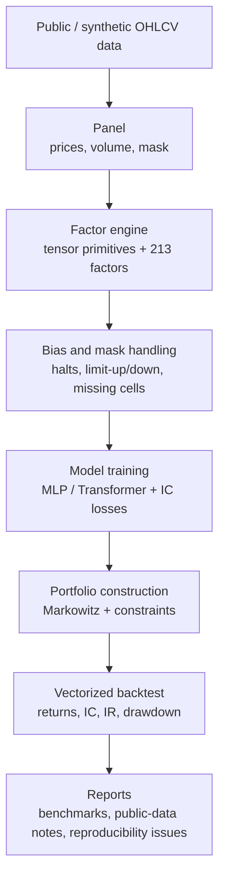

# Architecture

The repository is organised as a single Python package, ``mlquant``,
plus a CLI that exposes one sub-command per stage of the pipeline. The
sub-packages are self-contained and have explicit, narrow APIs.

```
src/mlquant/
├── data/        loaders, synthetic GBM panel, immutable Panel container
├── features/    GPU primitives, Alpha101 subset (9), legacy factors (204), neutralisation, bias mask
├── training/    FactorDataset, GBM augmentation, Trainer
├── models/      MLP / Transformer baselines, sign-aware losses
├── portfolio/   cvxpy-based Markowitz with α-sweep
├── backtest/    vectorised engine + paper-grade metrics
├── cli/         Click entry points wiring the stages together
└── utils/       config loading + deterministic seeding
```

## Data contract

Everything operates on a `Panel` — a frozen dataclass holding seven
``[T, N]`` tensors plus a tradability mask. Stages exchange `Panel`s
(or tensors that share its layout); they never reach into each other's
internals.



## Why this layout?

* **Mask-first.** Limit-up days, halts, pre-IPO cells, and lookahead
  shifts all have to be expressed as masks; making the mask a
  first-class member of every panel/feature tensor avoids the
  `nan`-versus-`0`-versus-`-1` confusion that plagues most A-share alpha
  research code.
* **No global state.** Each stage takes its inputs in its constructor
  and writes its outputs to a configured path. Re-running the
  ``backtest`` stage after a config tweak does not require re-running
  ``features`` or ``train``.
* **Solver-agnostic Markowitz.** The default install ships SCS / ECOS;
  MOSEK is opt-in. The same problem solves identically with either
  backend, so reproducibility doesn't depend on a commercial licence.
* **Synthetic data first.** The CI runs the full pipeline on a
  GBM-generated 200×500 panel — every PR exercises the optimiser, the
  trainer, and the metrics.

## Where the paper's contributions live

| Paper section                              | Module                              |
|--------------------------------------------|-------------------------------------|
| §3.1 Tensor-accelerated factor engine      | `mlquant.features.tensor_factors`   |
| §3.2 Alpha101 + microstructure factors     | `mlquant.features.alpha101`         |
| §3.3 Cross-sectional neutralisation        | `mlquant.features.neutralize`       |
| §3.4 Bias correction (limit days)          | `mlquant.features.bias`             |
| §4.1 GBM data augmentation                 | `mlquant.training.augment`          |
| §4.2 ML models & sign-aware losses         | `mlquant.models.{nets, losses}`     |
| §5   Cross-sectional Markowitz             | `mlquant.portfolio.markowitz`       |
| §6   Backtest, Sharpe, IC                  | `mlquant.backtest.{engine,metrics}` |
