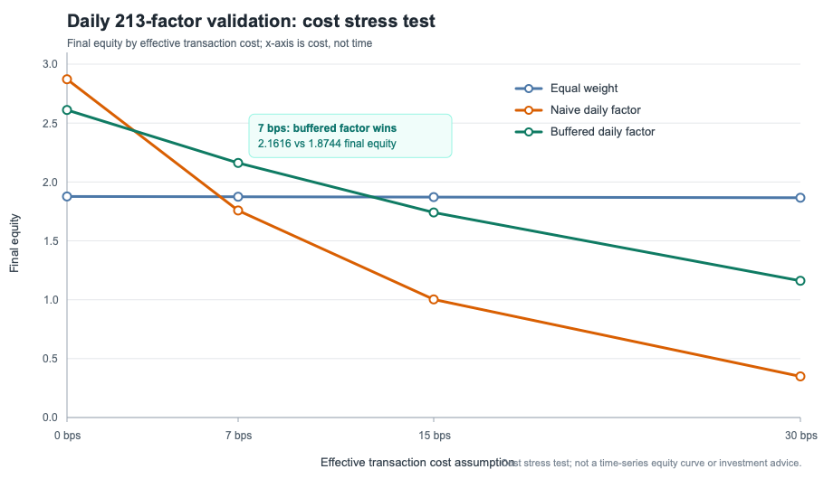

# 我开源了一个 213 因子的 PyTorch 量化框架，并在沪深 300 上做了含交易成本验证

> 项目：`ml-quant-trading`  
> 论文：Machine Learning Enhanced Multi-Factor Quantitative Trading  
> 本文所有结果仅用于研究与工程验证，不构成投资建议。



很多量化项目最吸引人的部分是一条漂亮的收益曲线，但真正决定研究能否复现的，
往往是曲线下面那些不太好看的细节：停牌和缺失值怎么处理、因子在哪个时点可见、
组合多久换一次、交易成本怎么扣、失败的模型有没有被隐藏。

我开源 `ml-quant-trading`，不是为了发布一条可以直接交易的信号，而是想把
多因子研究中从数据到回测的整条链路放到同一个可检查的工程里。

## 这个项目包含什么

项目的默认研究流程是：

```text
OHLCV 数据
  → 带 mask 的张量因子
  → 涨跌停 / 停牌偏差处理
  → MLP / Transformer
  → Markowitz 组合构建
  → 含成本的向量化回测
```

因子库目前有 213 维：

- 9 个精选 Alpha101 风格因子；
- 204 个从原研究代码整理出的手工因子；
- 横截面排名、滚动相关、时序排名、EWMA 等 PyTorch 张量算子；
- 涨停、跌停、停牌、上市前空值等 mask 语义。

数据入口包括 Synthetic、AkShare、Baostock 和 yfinance。没有行情账号时，可以
使用确定性 Synthetic 数据把整条工程链路跑通；需要公开 A 股路径时，可以使用
无需 API Key 的 AkShare。

## 为什么我没有只展示毛收益

日频因子排序很容易产生高换手。如果只展示扣费前结果，得到的往往不是可部署的
alpha，而是“免费交易”的假设。

因此这次公开验证固定采用：

- 当前沪深 300 成分股；
- AkShare 公开日线数据；
- 2021-01-04 至 2024-12-31；
- 969 个交易日 × 300 只股票；
- 全部 213 个注册因子；
- 0、7、15、30 bps 四档有效交易成本；
- 等权、朴素日频因子选择、缓冲因子组合等同区间基线。

这里使用的是当前成分股，并非历史时点成分股，因此存在幸存者偏差。这一点不能
靠一句“回测仅供参考”带过，必须明确写进结果边界。

## 结果里最值得看的不是 22.20%

在 7 bps 有效成本假设下：

| 策略 | 年化收益 | Sharpe | 最大回撤 | 换手率 | 成本拖累 | 最终净值 |
|---|---:|---:|---:|---:|---:|---:|
| 等权日频基线 | 17.75% | 0.882 | 25.76% | 0.0010 | 0.13% | 1.8744 |
| 朴素日频因子组合 | 15.80% | 0.701 | 32.51% | 0.3627 | 49.16% | 1.7579 |
| 缓冲日频因子组合 | 22.20% | 0.919 | 27.76% | 0.1397 | 18.94% | 2.1616 |

如果只看毛收益，朴素日频因子组合的年化收益是 31.57%，明显高于等权。但加入
换手和成本后，净年化收益下降到 15.80%，反而落后于等权。

这正是这次验证最有价值的结果：**因子计算正确，并不意味着组合能够保留因子边际。**

缓冲规则仍然每天评估分数，但不会因为股票刚刚跌出最窄的入选区间就立刻替换，
而是等它跌出更宽的退出区间。这个透明的小改动把换手率从 0.3627 降到 0.1397，
让更多毛因子边际在扣费后保留下来。

它不是一个“已经找到圣杯”的结论。它说明的是研究流程的优先级：在继续堆模型
之前，组合换手控制可能比把 MLP 换成更复杂网络更重要。

## 我也保留了失败结果

同一次公开运行里：

- IC 加权组合的净年化收益为负；
- 多个优化组合没有超过简单基线；
- 当前紧凑 MLP 路径没有形成可交易的非零组合。

这些结果仍然保留在机器可读报告中。公开研究如果只留下最好的那一行，就很难判断
结论是来自方法，还是来自多次尝试后的选择偏差。

## 一条命令跑通工程链路

本地安装后运行：

```bash
mlquant demo
```

它会依次生成确定性数据、计算 213 维因子、训练基线模型、构建投资组合并执行
含成本回测，同时写出 `summary.md` 和 `summary.json`。这条路径只用于确认工程
能够运行，不用于证明收益。

如果不想配置本地环境，可以直接打开零账号 Colab。Notebook 不要求行情 API，
跑完后会显示一份可以提交到 Discussion 的复现报告。

## 目前最需要什么反馈

这个项目现在最缺的不是更多 Star 数字，而是更多独立环境证据：

- 不同 CPU / GPU 的张量因子 benchmark；
- 不同公开数据源和股票池的复现；
- 对时间可见性、交易成本和组合约束的质疑；
- 首次安装失败或文档不清楚的具体报告。

唯一行动入口：

**[打开零账号 Colab，跑一遍并提交结果](https://colab.research.google.com/github/initial-d/ml-quant-trading/blob/main/notebooks/quickstart_colab.ipynb)**
