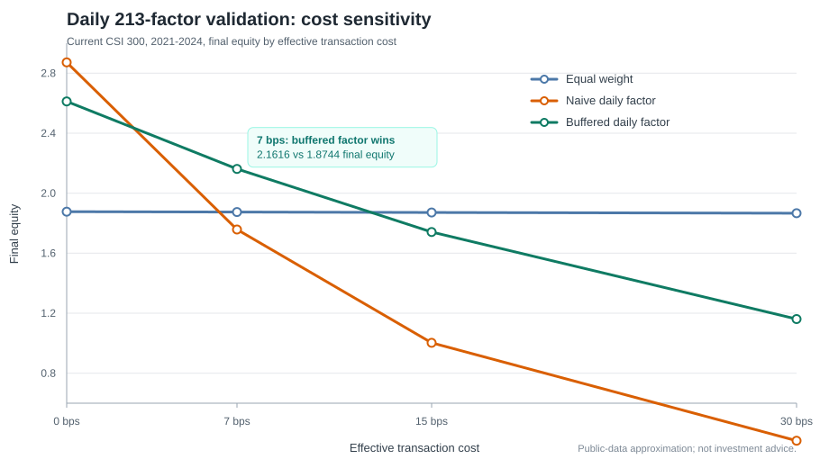

# Validation Dashboard

This page tracks the maintained public-data validation snapshot for
`ml-quant-trading`. It is designed as a reproducibility dashboard, not a live
trading scoreboard.

## Latest Snapshot

| Field | Value |
|---|---|
| Snapshot date | 2026-07-29 |
| Primary report | [AkShare CSI 300 Daily 213-Factor Validation](validation_akshare_csi300_full_pipeline_20260729.md) |
| Source | AkShare public A-share data |
| Universe | Current CSI 300 constituents |
| Date range | 2021-01-04 to 2024-12-31 |
| Panel shape | 969 dates x 300 stocks |
| Factor set | Full registered factor library, 213 factors |
| Main cadence | Daily evaluation and daily cost accounting |
| Effective cost | 7 bps |

## Headline Results



| Strategy | Annual return | Sharpe | Max drawdown | Turnover | Cost drag | Final equity |
|---|---:|---:|---:|---:|---:|---:|
| `equal_weight_daily` | 17.75% | 0.882 | 25.76% | 0.0010 | 0.13% | 1.8744 |
| `factor_mean_daily` | 15.80% | 0.701 | 32.51% | 0.3627 | 49.16% | 1.7579 |
| `factor_mean_buffered_daily` | 22.20% | 0.919 | 27.76% | 0.1397 | 18.94% | 2.1616 |

## What The Snapshot Shows

- The 213-factor mean signal has positive gross evidence: gross annual return is
  31.57% versus 17.79% for equal weight.
- The naive daily factor portfolio loses much of that edge to turnover and
  costs, which is the expected failure mode for rough daily rank selection.
- The buffered daily factor rule still evaluates scores daily, but avoids
  replacing a position until it falls out of a wider exit band. In this run that
  reduces turnover enough for the factor portfolio to beat equal weight after
  costs.
- The useful takeaway is framework-level: factor construction has to be paired
  with cost-aware portfolio construction before public-data backtests are
  interpreted as alpha evidence.

## Caveats

- This is not an exact paper reproduction. The paper data is not redistributed,
  and this public run uses current CSI 300 membership resolved at runtime.
- The public AkShare path does not include industry, size, liquidity, beta, or
  production execution metadata.
- Results can change when AkShare endpoints revise data or when the current CSI
  300 constituent list changes.
- The dashboard is updated manually for maintained validation snapshots. A
  scheduled refresh should be treated as monitoring, not as a source of trading
  claims.

## Acknowledgements

- Thanks to [@redamancy231-create](https://github.com/redamancy231-create) for
  contributing the AkShare zero-auth A-share data loader in
  [PR #42](https://github.com/initial-d/ml-quant-trading/pull/42). That data
  path made the CSI 300 public validation workflow possible without account
  registration.
- Thanks to the AkShare project and its maintainers for providing public Python
  access to A-share market data. Public endpoints can change, so this dashboard
  treats AkShare as a reproducibility aid rather than a production data vendor.

## Reproduce

```bash
python scripts/akshare_csi300_full_pipeline.py \
  --factor-set all \
  --max-tickers 300 \
  --start 2021-01-01 \
  --end 2025-01-01 \
  --rebalance-step 1 \
  --cost-grid-bps 0,7,15,30
```
